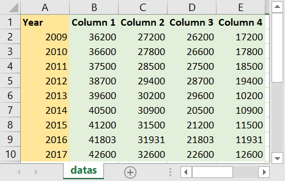
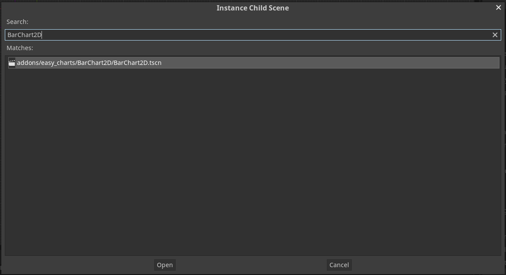
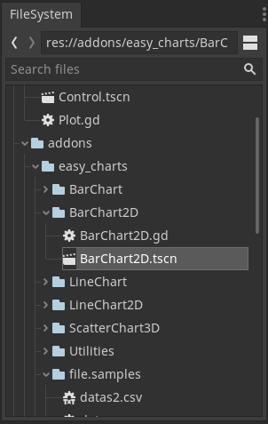
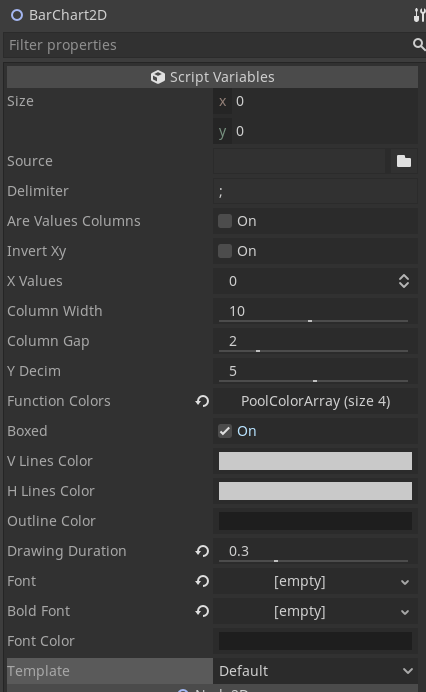
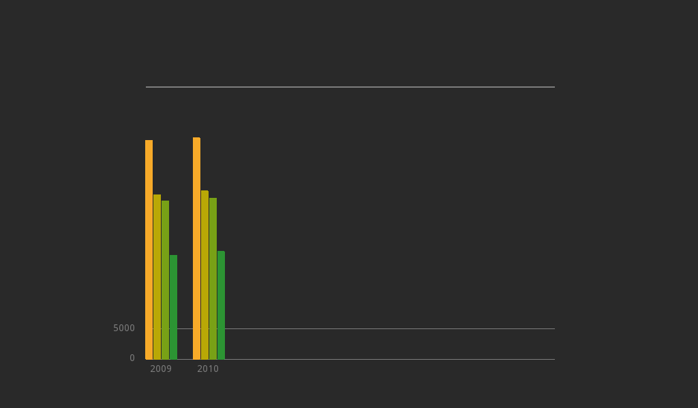
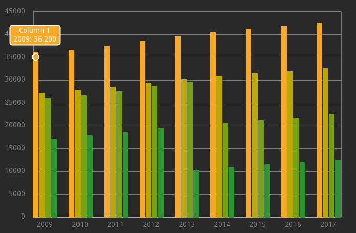

Check my **[Discord](https://discord.gg/KnJGY9S)** to stay updated on this repository.  
*(Recommended since the AssetLibrary is not automatically updated)*  

# GitHub Integration
A complete GitHub integration for your Godot Editor! Manage your project without even opening your browser.

Author: *"Nicolo (fenix) Santilio"*  
Version: *0.1.0*  
Wiki: *[wip]*  
Godot Version: *3.2stable*  

## What is this?
*Easy Charts* is collection of Control, 2D and 3D nodes to plot charts.   
This plugin was born from the personal necessity to plot some charts and tables for my university degree project.   
Here's an example:       
Charts are really useful when it comes to visually represent values in a powerful and more understandable way, mostly when these charts also have visually pleasing features.   
If you need to plot a chart with some values in it and just take a screenshot, or use it in your Godot Engine's game or project, you've come to the right place.  

## How does it work?
*Easy Charts* contains a collection of nodes for each main node in Godot: Control Nodes, 2D Nodes and 3D Spatials.
To plot a chart you only need to:   
1. Save in your project a .CSV file containing the table of values you want to represent, just like the following one:   

or, of course, the inverted one:   
   

2. In Godot, choose a Chart you'd like to plot. For istance, let's take a BarChart2D, specifically used to plot chart in a Node2D. You can instance it as a Child Scene or drag it from the Explorer:   
   
   

3. Once in the tree, move it around as a normal Node, and set it's values directly in editor, like so:   
   
You can directly select the file you want to plot from the editor, and change its values as you prefer. Most of the features will be displayed in real time in Editor while you are editing them.    

4. With just one line of code, you will be able to plot the chart. Use the line of code `$BarChart2D.plot()` to plot the chart with the properties edited in the editor.    
   
Running the project like this, will produce this chart:   

5. Moving the cursor around you will be able to see a floating box with the values contained in the chart:  

# Disclaimer  
This addon was built for a **personal use** intention. It was released as an open source plugin in the hope that it could be useful to the Godot Engine Community.  
As a "work in progress" project, there is *no warranty* for any eventual issue and bug that may broke your project.  
I don't assume any responsibility for possible corruptions of your project. It is always advisable to keep a copy of your project and check any changes you make in your Github repository.  

-----------------
> This text file was created via [TextEditor Integration](https://github.com/fenix-hub/godot-engine.text-editor) inside Godot Engine's Editor.

